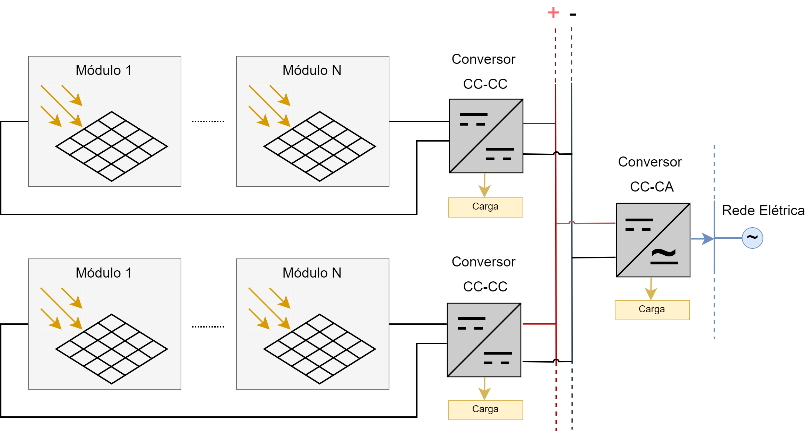

# Conversor CC-CC para Instalações Solares Fotovoltaicas de Potência Elevada

A nível mundial existe uma enorme dependência dos combustíveis fósseis para a produção de energia elétrica. O resultado da queima de combustíveis fósseis resulta numa emissão de CO2 para a atmosfera, provocando um enorme impacto ambiental. Entre outros motivos, a aposta em energias renováveis tem-se intensificando, nomeadamente na energia solar fotovoltaica, como fonte de energia elétrica de forma a mitigar os problemas inerentes à utilização de combustíveis fósseis. Portugal tem reforçado a sua parcela de energia obtida a partir de energias renováveis, tendo como objetivo atingir uma meta de 80 % da energia produzida, a partir destas, já em 2025.
As soluções de conversores de eletrónica de potência para interface com módulos solares PV são vastas e apresentam vantagens e desvantagens consoante a finalidade. Além disso, quando o propósito passa por eficiência é importante ter em conta a escolha dos semicondutores de potências mais indicados.
Este projeto consiste num estudo bibliográfico, implementação e desenvolvimento de um conversor de eletrónica de potência CC-CC para aplicações em instalações solares fotovoltaicas de potência elevada. Neste estudo, foi desenvolvido um conversor CC-CC do tipo *boost interleaved* controlado pelo algoritmo MPPT de condutância incremental, aliado a um controlador PI para controlo individual da corrente em cada braço, de modo a extrair a potência máxima disponibilizada pelo módulo solar fotovoltaico (PV) para diferentes condições de radiação e temperatura. Para a implementação do controlo do sistema foi utilizado o microcontrolador TMS320F28335 da Texas Instruments com programação em linguagem C.
Neste projeto integrador são apresentados os resultados de simulações computacionais, o dimensionamento do hardware e os resultados experimentais obtidos, comprovando o correto funcionamento do sistema.

## Configuração do tipo *multi-string*

---

## Conversor CC CC do tipo *Boost Interleaved*

---

## **Método da Condutância Incremental**

---

## Diagrama Geral do Sistema

---

## Protótipo

---

## Realizado por:
---
João Miranda, pg47332
Duarte Rodrigues, pg47158
Mestrado de Eletrônica de Potência de Energia @ Universidade do Minho, 2021

## Orientado por:
---
Professor Doutor Gabriel Pinto
Professor Luís Barros
